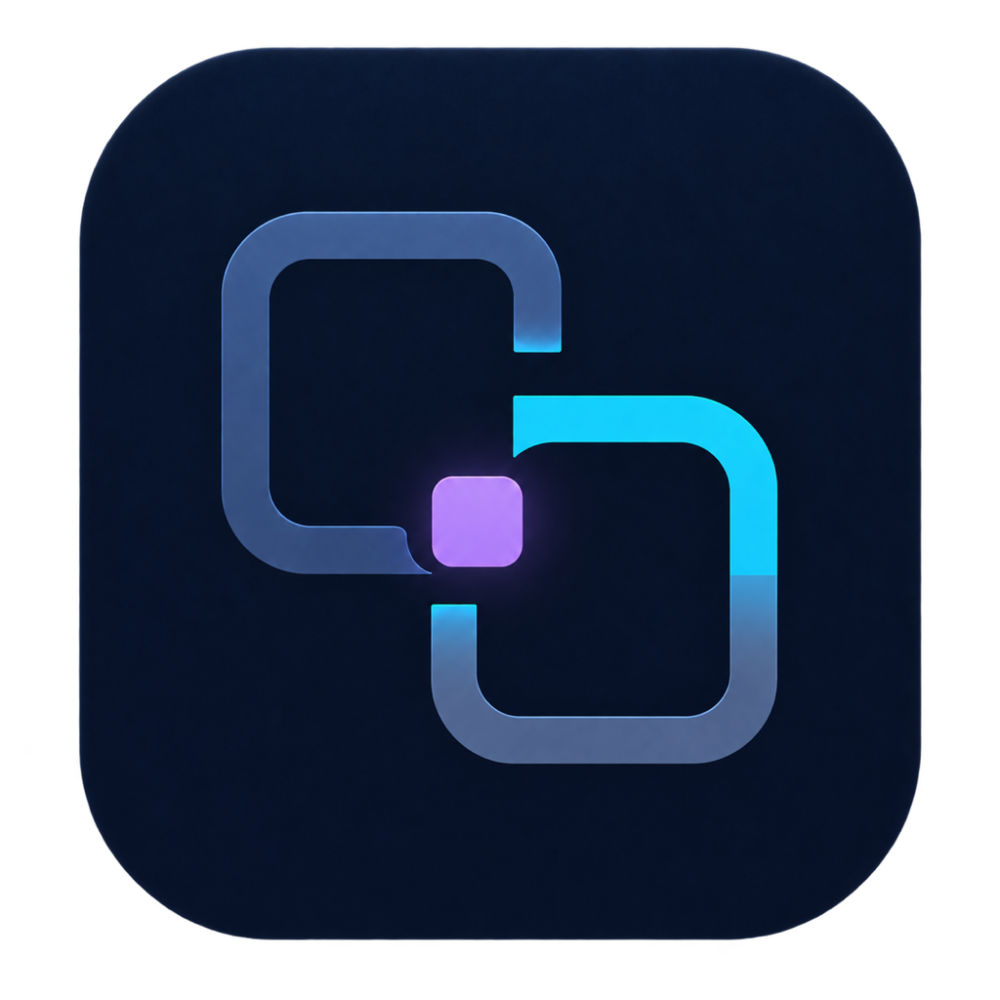

<p align="right">English · <a href="./README_CN.md">简体中文</a></p>
<p align="center"></p>
<h1 align="center">Your terminal. Your intelligence.</h1>
<p align="center">OpenWarp — a local-first AI terminal with your choice of models, Agent harnesses, and SSH tools.</p>
<p align="center"><a href="https://sasuke39.github.io/openwarp/">Website</a> · <a href="https://github.com/sasuke39/openwarp/releases/latest">Download for Mac</a> · <a href="https://sasuke39.github.io/openwarp/guide/getting-started">Documentation</a></p>

<p align="center"></p>
<p align="center"><sub>Illustrative UI preview. Hosts, paths, users, and model names are fictional.</sub></p>

## A familiar terminal. A backend of your own.

Keep the terminal experience. Choose the intelligence behind it. OpenWarp connects an independently configured desktop client to a local Agent Engine, your model endpoint, and local or managed SSH tools. It can coexist with official Warp.

| Your choice | What you get |
| :--- | :--- |
| **Models** | OpenAI-compatible endpoints, including DeepSeek, Ollama, OpenRouter, LM Studio, and vLLM. |
| **Agent harnesses** | Native, Pi Agent, or DeepSeek Harness, with model selection per profile. |
| **Local + SSH** | File search, reads, diffs, shell execution, and remote terminal context. |
| **Command control** | Foreground/background execution, output polling, input, cancellation, and exit status. |
| **Connected agents** | A local MCP bridge for Codex and Claude Code, reusing saved SSH identities. |
| **Native workspace** | Agent/terminal timeline, queued follow-ups, steering, SSH management, and Quick Paste. |

## Get started

1. Download [OpenWarp.app.zip](https://github.com/sasuke39/openwarp/releases/latest/download/OpenWarp.app.zip), unzip, and move the app to `/Applications`.
2. Open **Settings → Agent Engine** and add your endpoint, API key, model, and preferred harness.
3. Start a local or SSH workspace. Ask your agent, inspect its work, or switch to direct terminal input.

Prebuilt releases target **macOS Apple Silicon** and use a development signature, not Apple notarization. A complete Windows desktop installer is not available yet. Only if you trust the downloaded release and macOS blocks it, remove its quarantine attribute:

```bash
xattr -cr /Applications/OpenWarp.app
open /Applications/OpenWarp.app
```

## Connect your other agents

Current client source includes **Settings → MCP Access**: enable the bridge, authorize command/upload/download tools per server, and copy a Codex or Claude Code configuration. Upgrade or build the client if this page is missing. Keep OpenWarp running while connected. [MCP setup →](./docs/external-mcp/setup.md)

Closing MCP rejects new calls, including polling and cancellation; already admitted commands continue. Upload/download permissions govern transfer tools, not file operations through an authorized shell.

## Local-first, not a black box

Configuration and runtime state stay on your machine. Prompts and tool context go to the model endpoint you configure; offline use requires a local model service. Local-first does not mean remote providers receive no data.

OpenWarp is an independent community project, **not affiliated with Warp**. Subagents, computer use, passive suggestions, and full Warp cloud parity are not implemented.

## Under the hood

[Architecture diagram](./docs/public/architecture.svg) · [Supported tools](https://sasuke39.github.io/openwarp/guide/supported-tools) · [Configuration](https://sasuke39.github.io/openwarp/guide/configuration) · [Troubleshooting](https://sasuke39.github.io/openwarp/guide/troubleshooting)

This repository contains the local adapter and product documentation. The desktop source lives in [openwarp-client](https://github.com/sasuke39/openwarp-client). See the [build guide](./WARP_CLIENT.md) for bundling.

```bash
go test ./...
WARP_SRC=/path/to/warp-source sh ./build_and_bundle.sh
```

Adapter: [MIT](./LICENSE). Desktop client: [AGPL-3.0](https://github.com/sasuke39/openwarp-client/blob/main/LICENSE-AGPL), with its UI framework under [MIT](https://github.com/sasuke39/openwarp-client/blob/main/LICENSE-MIT).
