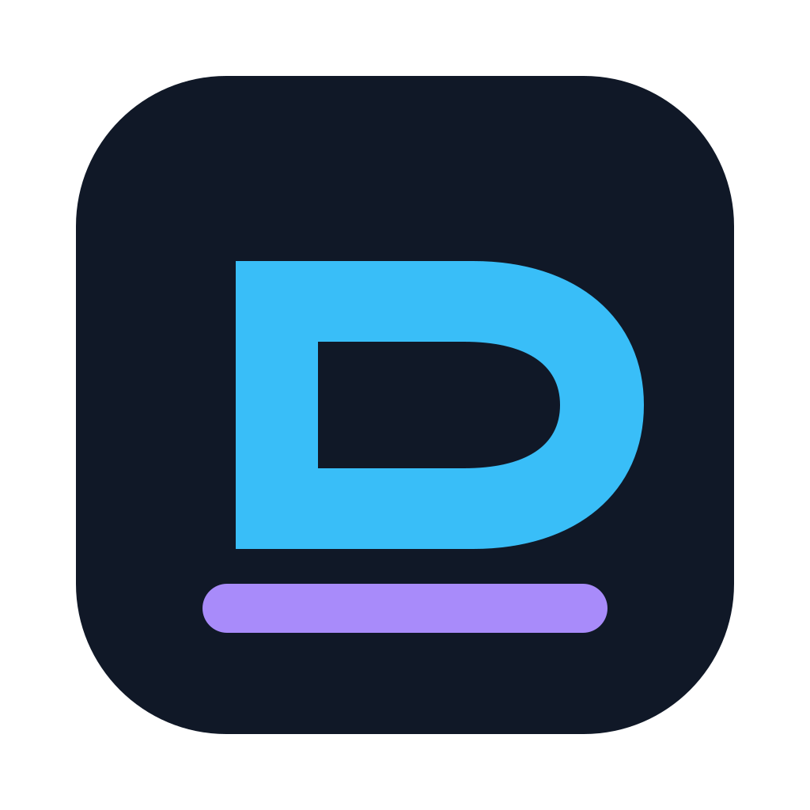
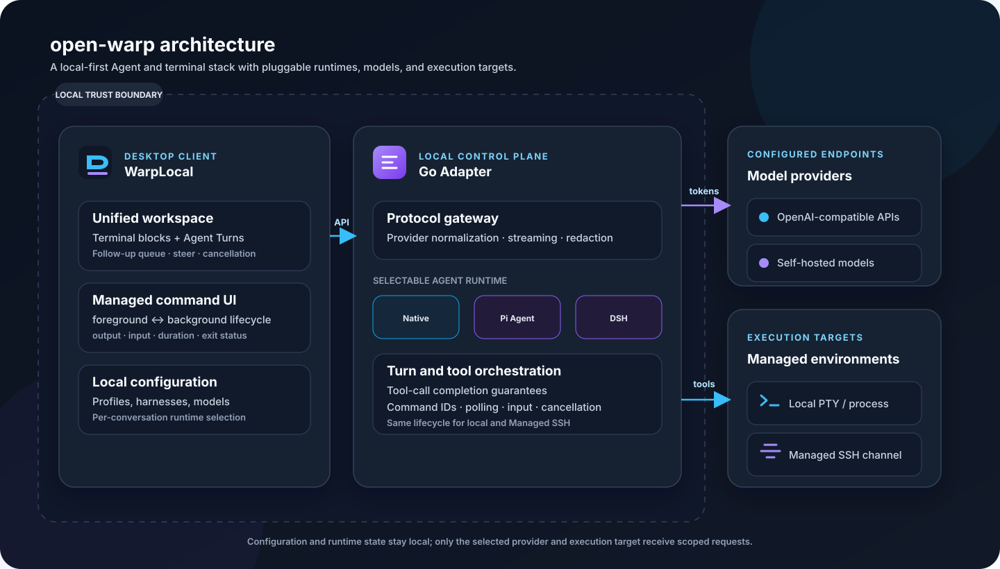
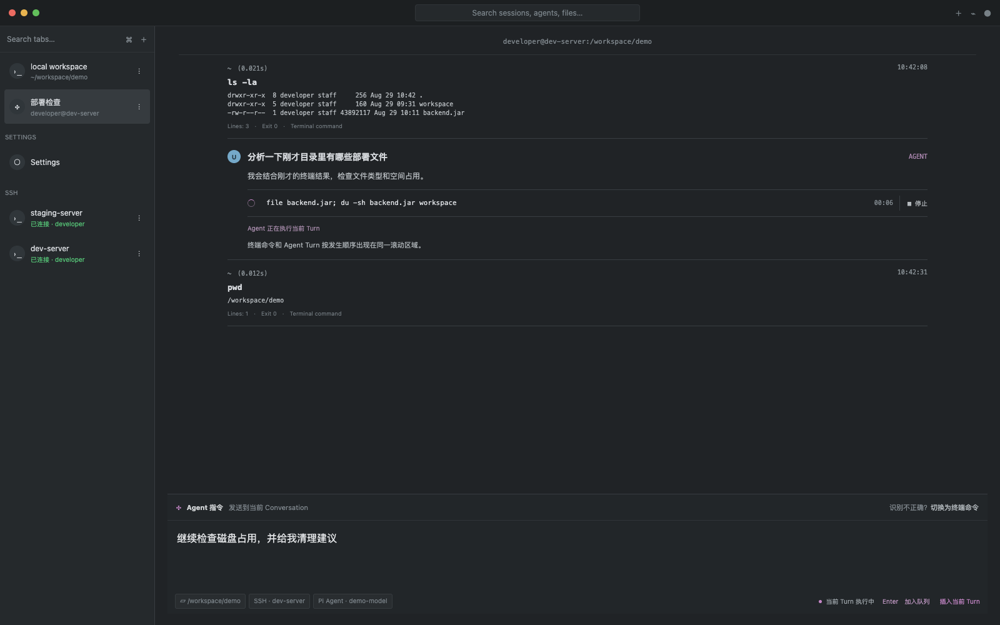
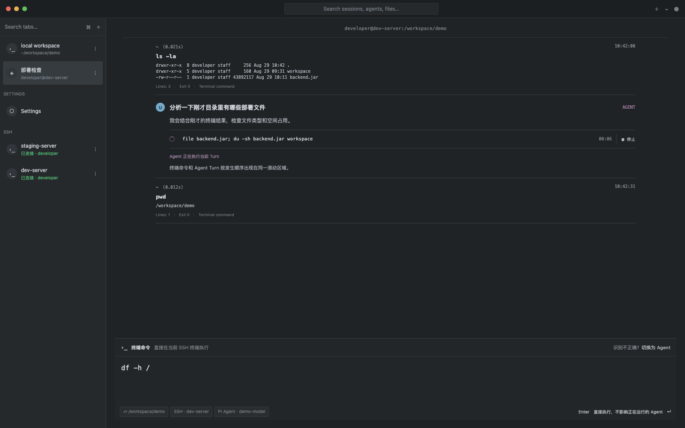

<p align="right"><a href="./README.md">English</a></p>
<p align="center"></p>
<h1 align="center">open-warp</h1>
<p align="center">在本地优先的 Warp 体验中使用自己的模型和 Agent 框架。</p>
<p align="center">
  <a href="https://github.com/sasuke39/openwarp/releases/latest"></a>
  
  <a href="./LICENSE"></a>
</p>

`open-warp` 将修改后的 Warp 客户端连接到本机 Go Adapter，并支持任意 OpenAI 兼容接口；同一套受管服务器工具也可提供给 Codex、Claude Code 等本地 MCP 客户端。它可与官方 Warp 同时安装，`WarpLocal.app` 使用独立配置与运行数据。

## 项目架构

<p align="center"></p>

<table>
  <tr><td></td><td></td></tr>
  <tr><td align="center">Agent 与终端事件出现在同一时间线</td><td align="center">Agent 运行时仍可直接使用终端</td></tr>
</table>

<p align="center"><sub>脱敏界面预览：其中的主机、用户、路径和模型名称均为虚构数据。</sub></p>

## 核心功能

- **自带模型服务**：支持 OpenAI、DeepSeek、Ollama、OpenRouter、LM Studio、vLLM 等 OpenAI 兼容接口。
- **可切换 Agent 框架**：支持 Native、Pi Agent、DeepSeek Harness，并可为 Profile 独立选择模型。
- **本地与受管 SSH 工具**：保留工作目录和远端上下文，可读文件、搜代码、应用修改和执行命令。
- **受管命令生命周期**：显式前台/后台模式，提供 `command_id`、输出读取、输入、停止、退出状态和执行器计时。
- **本地 MCP 桥接**：Codex、Claude Code 可复用已保存的 SSH 身份、默认目录、命令、进程和传输工具，无需复制服务器凭据。
- **不中断当前 Turn**：输入可排队为下一次 Follow-up，也可 Steer 当前 Turn，不会重复创建响应流。
- **原生管理界面**：在 WarpLocal 内管理服务商、模型、Agent Profile、SSH 连接和 Quick Paste 常用片段。

## 安装

从最新发布页下载 **[WarpLocal.app.zip](https://github.com/sasuke39/openwarp/releases/latest/download/WarpLocal.app.zip)**，解压后将 `WarpLocal.app` 移到 `/Applications`。

```bash
xattr -cr /Applications/WarpLocal.app
open /Applications/WarpLocal.app
```

当前预编译版本支持 **Apple Silicon（arm64）**，使用开发签名；Windows 完整安装包尚未提供。

## 配置与使用

1. 打开 **设置 → Local Adapter**。
2. 添加接口地址、API Key、模型和上下文长度，并选择 Agent 框架。
3. 打开本地或 SSH 终端，输入 Agent 指令。
4. 需要直接控制 Shell 时，可在同一输入区域切回终端模式。
外部 Agent 可通过本地 MCP stdio 桥接接入；使用前需在策略中明确授权可见服务器和传输目录。详见 [MCP 配置](./docs/external-mcp/setup.md)。
配置和运行数据保存在本机 WarpLocal 的 Application Support 目录中；提示词、工具上下文和 API 凭据只发送给你配置的模型服务。诊断包会隐藏密钥、Token、邮箱和用户目录，但分享前仍应人工检查。

## 项目状态

桌面 Agent 工作流、受管本地/SSH 命令生命周期和本地 MCP 桥接已经可用。子代理、计算机操作、被动建议和完整 Warp 云端能力尚未实现。本项目是独立社区项目，与 Warp 官方无隶属关系。

## 文档

[快速开始](https://sasuke39.github.io/openwarp/zh/guide/getting-started) · [配置](https://sasuke39.github.io/openwarp/zh/guide/configuration) · [工具](https://sasuke39.github.io/openwarp/zh/guide/supported-tools) · [故障排查](https://sasuke39.github.io/openwarp/zh/guide/troubleshooting) · [构建指南](./WARP_CLIENT.md)

## 开发

```bash
go test ./...
WARP_SRC=/path/to/warp-source sh ./build_and_bundle.sh
```

项目采用 MIT 协议，详见 [LICENSE](./LICENSE)。
